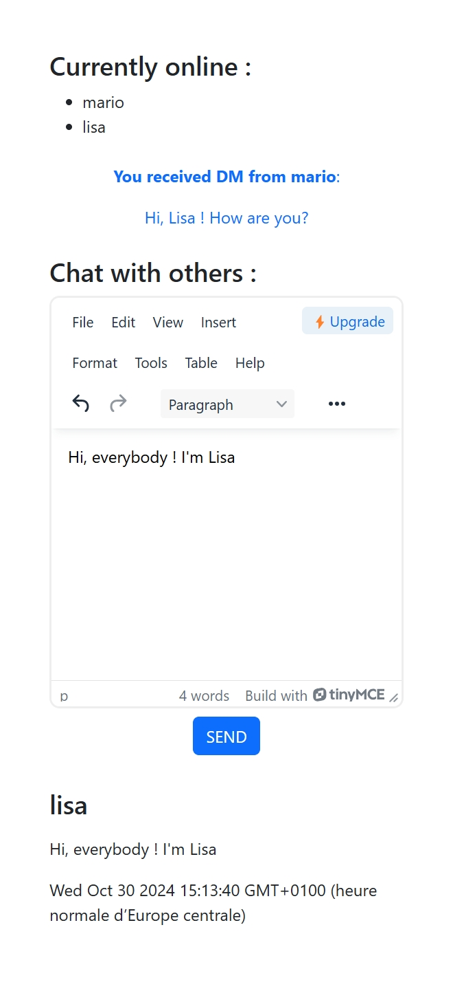

 # Real-Time Chat App 💬
Welcome to Real-Time Chat App! 🎉 This is a collaborative project developed during my CSI training. This app is a Node.js-based chat platform where users can register and send public messages to each other in real-time. Built with Node.js, Express, and TinyMCE for rich text editing, this chat app showcases core web development concepts and real-time messaging! 🚀

 

## Features 🌟
- User Registration 🔑 - Create your profile and join the conversation.
- Public Chat 💬 - Message with everyone in real-time!
- Rich Text Messages ✨ - Compose messages with TinyMCE, supporting text styling and emojis!
- Easy to Setup 🛠️ - Minimal setup with Node.js and Express.

## Tech Stack 📦
* Node.js - Backend JavaScript runtime.
* Express - Web framework for handling routes and server logic.
* TinyMCE - Rich text editor for styling messages.
* Socket.io - Real-time communication for instant messaging.

## Getting Started 🚀

### Prerequisites
Ensure you have Node.js and npm installed.

### Installation

1. Clone the repository:
`` git clone https://github.com/elledevelope/ifachat `` ->  ``cd ifachat`` 

2. Restore Node project:
`git clone url` -> `npm update` -> `npm init`

3. Start the server:
`node index.js`

## Usage ✨
Register as a new user or login if you already have an account.
Type and format your message using the TinyMCE editor.
Send your message and watch it appear instantly in the public chat room.

## Future Improvements 📚
* Security for User Connections 🔒 - Implement enhanced security features, such as HTTPS, token-based authentication, and data encryption.
* Private Messaging 🤫 - One-on-one messaging with users.
* User Avatars 🖼️ - Add avatars for a more personalized chat experience.
* Emojis & Reactions 👍 - React to messages with emojis.
* Message History 📜 - Store and retrieve past conversations.

## Contributing 👨‍💻
Feel free to fork this repository, create a new branch, and submit a pull request if you’d like to contribute. Contributions, feedback, and suggestions are always welcome! 🌟

## License 📜
This project is open-source and available under the ISC License.

## Author 👤

- GitHub: [@elledevelope](https://github.com/elledevelope)
__________________________

Happy chatting! 🎉

